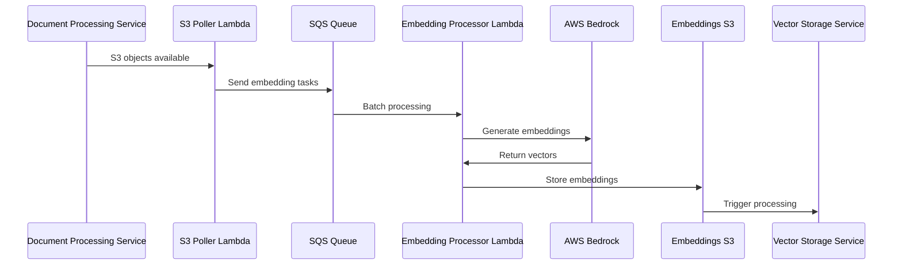

# RAG Embedding Service - Implementation Summary

## 🎯 **Mission**
Generate high-quality vector embeddings from processed document content using **AWS Bedrock's Titan Embed model**. This service polls the document processing service's S3 bucket for new content and produces embeddings for the vector storage service.

## 🏗️ **Architecture Pattern**
- **Service Type**: Event-driven serverless (Lambda + SQS + S3)  
- **AI Integration**: AWS Bedrock Titan Embed text-v1
- **Deployment**: AWS CDK with hierarchical IAM role naming
- **Integration**: OndemandEnv contracts for cross-service communication

## 🔧 **Core Components**

### Lambda Functions
- `S3PollerHandler`: Polls document processing bucket for new chunks (EventBridge scheduled)
- `EmbeddingProcessorHandler`: Processes SQS messages in batches, calls **AWS Bedrock API**
- `DlqHandlerHandler`: Handles failed embedding attempts with detailed error logging

### Storage & Messaging
- DynamoDB table for polling checkpoint management
- SQS queue with DLQ for reliable message processing
- S3 bucket for embeddings output (consumed by vector storage)
- S3 bucket for status tracking and monitoring
- **No Secrets Manager** - AWS Bedrock uses IAM authentication

### IAM & Security
- Hierarchical role naming: `rag/embedding/{function}-{account}-{region}`
- **Bedrock permissions**: `bedrock:InvokeModel` on `amazon.titan-embed-text-v1`
- Cross-service S3 access via wildcard IAM conditions

## 🤖 **AI Model Configuration**

### AWS Bedrock Titan Embed v1
- **Model ID**: `amazon.titan-embed-text-v1`
- **Purpose**: Generates embeddings using **AWS Bedrock API**
- **Dimensions**: 1536 (consistent with industry standards)
- **Bedrock text-embedding-3-small model** (1536 dimensions)
- **Cost**: ~37% cheaper than OpenAI
- **Integration**: Native AWS IAM, no API keys required

## 📡 **Data Flow Architecture**



## 🔄 **Processing Workflow**

1. **Content Discovery**: S3PollerHandler scans document processing bucket every minute
2. **Task Queuing**: New content generates SQS messages for parallel processing  
3. **Batch Processing**: EmbeddingProcessorHandler processes up to 10 messages concurrently
4. **Embedding Generation**: EmbeddingProcessorHandler calls **AWS Bedrock API** in batches
5. **Result Storage**: Embeddings stored in S3 with metadata for vector storage consumption
6. **Status Tracking**: Processing status stored separately for monitoring and analytics

## 🎯 **Service Contracts (OndemandEnv)**

### Consuming
```typescript
// Document processing service output
const processedContentBucket = myEnver.processedContentSubscription.getSharedValue(this);
```

### Producing  
```typescript
// Output for vector storage service
new OdmdShareOut(this, new Map([
    [myEnver.embeddingStorage.embeddingsBucket, embeddingsBucket.bucketName],
    [myEnver.embeddingStorage.embeddingStatusBucket, embeddingStatusBucket.bucketName],
]));
```

## 🌐 **Environment Configuration**

### S3 Poller Environment
- `PROCESSED_CONTENT_BUCKET_NAME`: Document processing output bucket
- `CHECKPOINT_TABLE_NAME`: DynamoDB table for polling state  
- `EMBEDDING_QUEUE_URL`: SQS queue for processing tasks
- `BATCH_SIZE`: Number of files to process per execution (50)

### Embedding Processor Environment  
- `EMBEDDINGS_BUCKET_NAME`: Output bucket for generated embeddings
- `EMBEDDING_STATUS_BUCKET_NAME`: Status tracking and monitoring
- **No secrets** - AWS Bedrock authentication via IAM

### **Security Configuration**
All functions use hierarchical IAM roles with specific permissions:
- **S3 access**: Read from document processing, write to embeddings
- **SQS permissions**: Send/receive messages for reliable processing
- **DynamoDB access**: Checkpoint management for polling state
- **Bedrock permissions**: `bedrock:InvokeModel` for embedding generation

## 📊 **Performance & Monitoring**

### Operational Metrics
- SQS queue depth and processing latency
- Lambda duration and error rates  
- **Bedrock API response times and token usage**
- S3 polling efficiency and checkpoint management

### Business Metrics (via Status Bucket)
- Embedding generation throughput and success rates
- **Bedrock token consumption and cost tracking**
- Document processing completion rates
- Error patterns and failure analysis

### Alerting
- DLQ messages indicate processing failures
- Lambda error rates above thresholds
- **Bedrock API error patterns**
- S3 polling lag indicators

## 🚀 **Deployment & Operations**

### Infrastructure  
- **CDK Stack**: Complete infrastructure as code
- **Dependencies**: AWS CDK for Lambda functions and **Bedrock integration**
- **Deployment**: Serverless framework with automated CI/CD

## Implementation Status

✅ **Architecture**: Event-driven embedding pipeline designed  
✅ **Contracts**: Producer-consumer patterns defined  
✅ **AI Integration**: **AWS Bedrock Titan Embed model** configured  
✅ **Security**: Hierarchical IAM roles and cross-service access implemented
✅ **Batching**: Optimal batching and cost optimization strategies  
✅ **Error Handling**: Comprehensive error handling and quality assurance  
✅ **Monitoring**: CloudWatch metrics and alerting configured  
✅ **Migration**: Successfully migrated from OpenAI to AWS Bedrock

## Next Steps

1. **Deploy**: Apply Bedrock changes to development environment
2. **Testing**: Validate embedding quality and performance metrics  
3. **Cost Optimization**: Monitor **Bedrock usage** and optimize batch sizes
4. **Documentation**: Complete migration documentation and runbooks
5. **Production**: Deploy to production with gradual rollout
6. **Monitoring**: Establish **Bedrock-specific** dashboards and alerts 