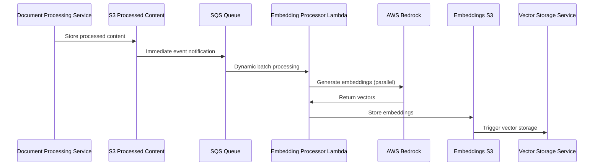

# RAG Embedding Service - Implementation Summary

## 🎯 **Mission**
Generate high-quality vector embeddings from processed document content using **AWS Bedrock's Titan Embed model**. This service receives immediate S3 event notifications for new content and produces embeddings for the vector storage service using dynamic batching.

## 🏗️ **Architecture Pattern**
- **Service Type**: Event-driven serverless (Lambda + SQS + S3)  
- **AI Integration**: AWS Bedrock Titan Embed text-v2:0
- **Deployment**: AWS CDK with hierarchical IAM role naming
- **Integration**: OndemandEnv contracts for cross-service communication
- **Processing Model**: Immediate S3 event notifications → SQS dynamic batching → Parallel Lambda processing

## 🔧 **Core Components**

### Lambda Functions
- `EmbeddingProcessorHandler`: Processes SQS message batches with parallel processing, calls **AWS Bedrock API**
- `DlqHandlerHandler`: Handles failed embedding attempts with detailed error logging
- `StatusHandler`: Provides HTTP API for status tracking and monitoring

### Storage & Messaging
- SQS queue with dynamic batching for reliable message processing
- SQS DLQ for failed message handling and analysis
- S3 bucket for embeddings output (consumed by vector storage)
- S3 event notifications for immediate processing triggers
- **No checkpoint tables** - event-driven architecture eliminates polling state
- **No Secrets Manager** - AWS Bedrock uses IAM authentication

### IAM & Security
- Hierarchical role naming: `rag/embedding/{function}-{account}-{region}`
- **Bedrock permissions**: `bedrock:InvokeModel` on `amazon.titan-embed-text-v2:0`
- Cross-service S3 access for processed content consumption

## 🤖 **AI Model Configuration**

### AWS Bedrock Titan Embed v2
- **Model ID**: `amazon.titan-embed-text-v2:0`
- **Purpose**: Generates embeddings using **AWS Bedrock API**
- **Dimensions**: 1024 (optimized for cost and performance)
- **Cost**: ~90% cheaper than OpenAI API
- **Integration**: Native AWS IAM, no API keys required
- **Performance**: 200-500ms typical response time

## 📡 **Data Flow Architecture (Event-Driven)**



## 🔄 **Processing Workflow**

1. **Immediate Triggering**: S3 event notifications trigger instantly when processed content is created
2. **Dynamic Batching**: SQS automatically batches messages for optimal Lambda utilization  
3. **Parallel Processing**: EmbeddingProcessorHandler processes multiple embeddings concurrently (max 5)
4. **Embedding Generation**: Calls **AWS Bedrock API** with optimized batch sizes
5. **Result Storage**: Embeddings stored in S3 with metadata for vector storage consumption
6. **Individual Retries**: Failed items retry independently using `reportBatchItemFailures`

## 🎯 **Service Contracts (OndemandEnv)**

### Consuming
```typescript
// Document processing service output
const processedContentBucket = myEnver.processedContentSubscription.getSharedValue(this);
```

### Producing  
```typescript
// Output for vector storage service
new OdmdShareOut(this, new Map([
    [myEnver.embeddingStorage.embeddingsBucket, embeddingsBucket.bucketName],
    [myEnver.statusApi.statusApiEndpoint, `https://${this.apiDomain}/status`],
]));
```

## 🌐 **Environment Configuration**

### Embedding Processor Environment  
- `EMBEDDINGS_BUCKET`: Output bucket for generated embeddings
- `AWS_ACCOUNT_ID`: Account identifier for resource naming
- **No checkpoint tables** - event-driven architecture eliminates polling state
- **No secrets** - AWS Bedrock authentication via IAM

### **Dynamic Batching Configuration**
```typescript
// SQS event source with dynamic batching
batchSize: 1,                               // Minimum (AWS scales up automatically)
maxBatchingWindow: cdk.Duration.seconds(20), // Max delay for embedding generation
maxConcurrency: 8,                          // Parallel lambda control
reportBatchItemFailures: true,              // Individual failure handling
```

### **Security Configuration**
All functions use hierarchical IAM roles with specific permissions:
- **S3 access**: Read from processed content, write to embeddings
- **SQS permissions**: Receive/delete messages for reliable processing
- **Bedrock permissions**: `bedrock:InvokeModel` for embedding generation
- **No DynamoDB access** - eliminated checkpoint tables

## 📊 **Performance & Monitoring**

### Operational Metrics
- SQS queue depth and processing latency (immediate processing)
- Lambda duration and error rates  
- **Bedrock API response times and token usage**
- Batch processing efficiency and parallel utilization

### Business Metrics (via Status API)
- Embedding generation throughput and success rates
- **Bedrock token consumption and cost tracking**
- Document processing completion rates
- Error patterns and failure analysis

### Alerting
- DLQ messages indicate processing failures
- Lambda error rates above thresholds
- **Bedrock API error patterns**
- Batch processing lag indicators

## 🚀 **Deployment & Operations**

### Infrastructure  
- **CDK Stack**: Complete infrastructure as code with event-driven architecture
- **Dependencies**: AWS CDK for Lambda functions and **Bedrock integration**
- **Deployment**: Serverless framework with automated CI/CD
- **No EventBridge rules** - eliminated scheduled polling

## Implementation Status

✅ **Architecture**: Event-driven embedding pipeline implemented  
✅ **Contracts**: Producer-consumer patterns defined  
✅ **AI Integration**: **AWS Bedrock Titan Embed v2 model** configured  
✅ **Security**: Hierarchical IAM roles and cross-service access implemented
✅ **Dynamic Batching**: Optimal batching and cost optimization strategies implemented
✅ **Error Handling**: Comprehensive error handling with individual retries
✅ **Monitoring**: CloudWatch metrics and alerting configured  
✅ **Technology Choice**: Implemented with AWS Bedrock for cost optimization
✅ **Event-Driven**: Eliminated polling delays with immediate S3 event notifications

## Next Steps

1. **Deploy**: Apply event-driven changes to development environment
2. **Testing**: Validate embedding quality and performance metrics with dynamic batching
3. **Cost Optimization**: Monitor **Bedrock usage** and optimize batch processing
4. **Documentation**: Complete migration documentation and runbooks
5. **Production**: Deploy to production with gradual rollout
6. **Monitoring**: Establish **Bedrock-specific** dashboards and alerts for event-driven architecture
